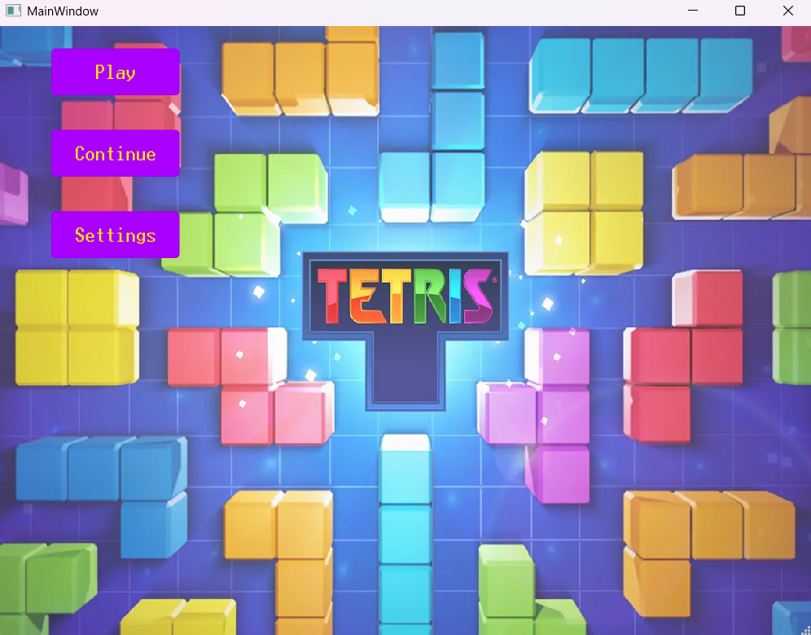
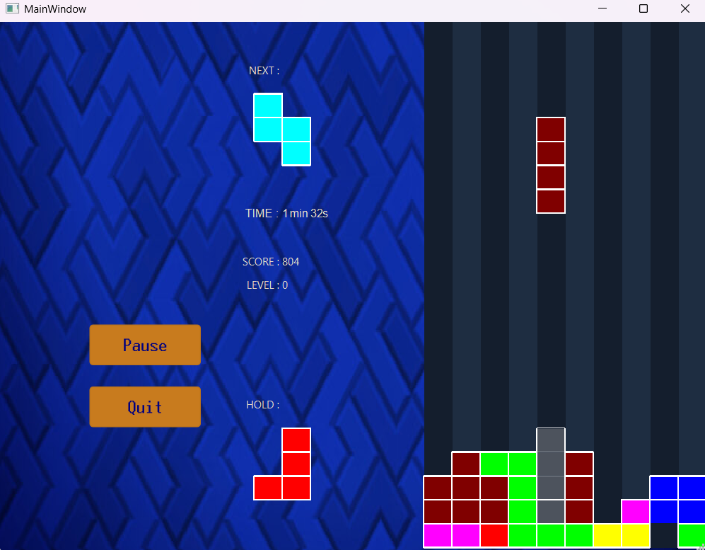

# Tetris C++ (Qt)

Tetris game developed in C++ using the Qt framework as part of an engineering school project (Polytech Clermont – IMDS).

## Documentation

A complete set of documentation is available in the `manuels_&_rapport` folder:

- Developer manual (detailed architecture and implementation)
- User manual
- Full project report

These documents include UML diagrams, design choices, and detailed explanations of the system.  
Note: documentation is written in French.

## Preview

### Main Menu

### Gameplay

---

## Overview

This project is a full implementation of the classic Tetris game, featuring a complete GUI, game logic, and state management system.

The application includes multiple screens (menu, game, pause, end, settings) and supports gameplay features such as piece rotation, collision handling, scoring, and save/load functionality.

---

## Features

- Full Tetris gameplay implementation
- Multiple game states (Menu, Game, Pause, End, Settings, Save, Difficulty)
- 3 difficulty levels (Easy, Medium, Hard)
- Next piece preview
- Hold system
- Ghost piece (projection)
- Score and timer system
- Line clearing logic (up to 4 lines)
- Save and load system (file-based)
- Background music
- Keyboard and mouse controls
- Pause and resume system

---

## Technologies

- C++17
- Qt (Core, GUI, Widgets)

---

## Architecture

The project is structured around four main classes:

### MainWindow
Handles:
- UI screens (menu, game, pause, etc.)
- Button interactions
- Keyboard and mouse events
- Game loop via timer events

### Game
Core game logic:
- Tetromino generation (7 types)
- Movement and rotation
- Collision detection
- Score management
- Ghost piece rendering

### Grid
Represents the game board:
- 2D dynamic array
- Line detection and clearing
- Integration of landed pieces

### Tetromino
Represents game pieces:
- 7 types (I, J, L, O, S, T, Z)
- 4 rotation states
- Stored as 4x4x4 matrices
- Movement and rotation logic

---

## Key Algorithms

### Collision Detection

A preventive collision system checks:
- Grid boundaries
- Overlapping with existing blocks

Each move or rotation is validated before being applied.

---

### Line Clearing

- Detects full lines
- Removes them
- Shifts upper rows downward
- Returns number of cleared lines (0–4)

---

### Ghost Piece

A projection of the current tetromino is computed by simulating its fall until collision, then displayed in grey.

---

### Save System

- Game state is saved into a text file
- Allows resuming a previous game

---

## Authors

- Adrien Labayle
- Thomas Mas

---

## Notes

This project focuses on:
- Object-oriented design
- Game logic implementation
- GUI development with Qt
- Event-driven programming

---

## Possible Improvements

- Sound effects
- UI/UX improvements
- Animations (line clear, piece drop)
- High score system
- Code refactoring (memory management, modern C++)